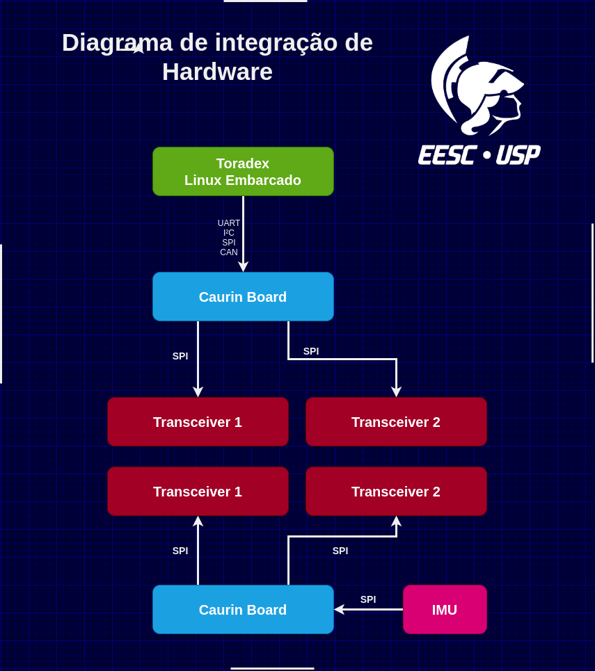

# Onboard Data Logger


Trabalho da disciplina SAA0356 realizada durante o segundo semestre de 2020.

## Vamos lá!

Apresenta-se, como proposta de aplicação de sistemas embarcados, o uso de um IMU embarcado em uma aeronave, cuja atitude medida é utilizada para visualização dos ângulos de rolagem, arfagem e guinada em função do tempo. Como exemplo, imagina-se a utilização deste sistema em aeronaves em shows aéreos da Academia da Força Aérea, de forma que a visualização de seus ângulos de rotação, sob a forma de gráficos e figura 3D, colabore na visualização da complexidade das manobras e acrobacias. 

## Pré-requisitos

<p align="center">
  
</p>


1. Escolha do IMU: 
O IMU é um sensor que, geralmente, combina as funcionalidades de acelerômetros, giroscópios e magnômetro, e permite medir a atitude de um objeto. 
Os acelerômetros são responsáveis por medir a variação de velocidade de um corpo. Os giroscópios medem as velocidades angulares. Por fim, os magnômetros medem a direção do campo magnético, funcionando como bússolas. 
Nosso projeto consistirá, portanto, no uso de um IMU embarcado em uma aeronave, cuja atitude medida será utilizada para plotagem de gráficos e visualização das rotações em um modelo tridimensional.

2. Protocolo de integração
SPI (Serial Peripheral Interface) é um protocolo de integração que possibilita que um microcontroador se comunique com outros componentes, de forma a criar uma rede. É utilizada para comunicações em pequenas distâncias, de forma síncrona, e funciona na forma "full duplex", de maneira "master-slave" com um master e múltiplos slaves.
Quando em modo master, o microcontrolador gera sinal de clock e, os que estão na posição de slaves, recebem o este sinal.

3. Protocolo de comunicação
Utiliza-se, neste projeto, o protocolo de comunicação TCP (Transmission Control Protocol), que garante comunicações a partir das quais diferentes aplicações podem trocar informações,e o qual utiliza IP (Internet Protocol). Nesse contexto, a comunicação entre a placa e a máquina host é feita por rede Wi-fi, via socket, e na máquina host é feita a integração entre os dados e a interface gráfica.

4. A comunicação é feita via sockets, que transmite dados na forma peer-to-peer, garantindo que o cliente envie informações para o servidor, e obtenha respostas deste.

5. Utiliza-se 10 ms como tempo de amostragem para o sistema de captação de atitude.

## Socket

	Para que pudéssemos realizar o objetivo de estabelecer uma comunicação entre placa e computador, a fim de receber os dados da placa e conseguirmos, no computador, visualizar a atitude a qual está submetida a placa, por meio de uma interface gráfica, era de extrema importância conseguirmos entender a comunicação via socket.
	Neste trabalho, pudemos aprender como isso é feito, e uma das dificuldades foi entender tudo o que é preciso, nas implementações, para que cada parte da conexão exerça sua função de forma adequada. 
	Ao utilizarmos o protocolo de comunicação TCP, que funciona como se, de forma abstrata, houvesse uma conexão entre computador e placa, a comunicação é feita via socket. Nesse contexto, uma vez que temos, nesse tipo de comunicação, o servidor e o cliente, é necessário implementar o código para ambas as partes. 
	Para o servidor, é necessário que esse seja capaz de deixar aberta uma “porta”, de forma que esteja “aberto” à comunicação com o cliente. Tendo feito isso, é necessário que o servidor aguarde um cliente se conectar e, assim que isso é feito, esteja apto a receber dados do cliente, podendo também dar-lhe respostas. 
	O cliente, por sua vez, deve ser capaz de estabelecer a conexão com o servidor, via socket, a partir do IP do servidor e do número da porta a qual foi destinada para a conexão desejada. Ao se conectar, o cliente deve ser capaz de enviar informações e receber as respostas do servidor. 
	 


### Installing

Comandos no terminal:

#### 1. Cliente

##### 1.1. Comunicação entre host e placa: 

```sh
sudo sftp debian@(IP da comunicação)
```

##### 1.2. Localiza o diretório do arquivo server

##### 1.3. Cópia do código do server para a placa:
```sh
put socket_client 
```
##### 1.4. Estando o arquivo na placa, faz-se sua compilação:
```sh
gcc socket_client.c -o socket_client
```
##### 1.5. Execução do código na placa:
```sh
./socket_client
```
#### 2. Servidor

##### 2.1 Na máquina host, compila-se o arquivo do código:
```sh
gcc socket_server.c -o socket_server
```
##### 2.2. Executa-se o cófigo do servidor no host:
```sh
./socket_server
```
## Interface gráfica

TO DO


### Bibliotecas necessárias em Python (instale antes de rodar)

> [pyvista](https://docs.pyvista.org/) <br/>
> [numpy](https://numpy.org/install/) <br/>
> [vpython](https://www.glowscript.org/docs/VPythonDocs/index.html) <br/>
> [numpy-stl](https://pypi.org/project/numpy-stl/)

## Funcionamento

TO DO

## Alunos

* **João Matheus Siqueira Souza** - *EESC/USP* - [GitHub](https://github.com/jmssouza)
* **Marina Gabriela Alves** - *EESC/USP* - [GitHub](https://github.com/MarinaGabrielaAlves)
* **Vinicius Aquilante Policarpo** - *EESC/USP* - [GitHub](https://github.com/viniciusapolicarpo)
* **William Zaniboni Silva** - *EESC/USP* - [GitHub](https://github.com/WilliamZaniboni)


## Agradecimentos

Este trabalho compõe os critérios de avaliação da matéria Sistemas Embarcados, e só foi possível a partir dos conceitos ensinados nas aulas do Professor Doutor Glauco Augusto de Paula Caurin e de sua equipe.

