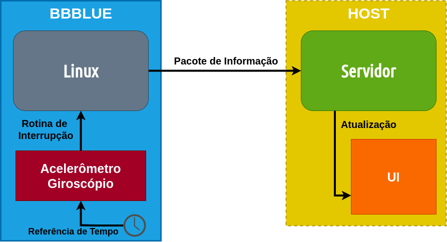

# Onboard Data Streamer

Trabalho da disciplina *SAA0356 - Sistemas Embarcados para Veículos Aéreos*, oferecida pelo *Professor Doutor Glauco Augusto de Paula Caurin* do Departamento de Engenharia Aeronáutica da Escola de Engenharia de São Carlos/Universidade de São Paulo durante o segundo semestre de 2020. <br/>


## Alunos/Desenvolvedores

* **João Matheus Siqueira Souza** - *EESC/USP* - [GitHub](https://github.com/jmssouza)
* **Marina Gabriela Alves** - *EESC/USP* - [GitHub](https://github.com/MarinaGabrielaAlves)
* **Vinicius Aquilante Policarpo** - *EESC/USP* - [GitHub](https://github.com/viniciusapolicarpo)
* **William Zaniboni Silva** - *EESC/USP* - [GitHub](https://github.com/WilliamZaniboni)


# Introdução

Dentro da aeronautica, a determinação e controle de atitude (Attitude Detemination and Control - ADC) de uma aeronave é de fundamental importância para a existência do voo. Com a crescente utilização de Veículos Aéreos Não Tripulados (VANT's) para as mais variadas aplicações, iniciou-se um processo de barateamento da tecnologia de ADC, visando disseminar ainda mais a utilização desses veículos e tornar possível aplicações que não tenham capacidade de prover grandes investimentos. 


Este trabalho consiste na implementação de um sistema de fusão sensorial simplificado, o qual permite aquisitar sinais de uma unidade de medida inercial (*Inertial Measurement Unit - IMU*), calcular a atitude desse sensor - módulo que estaria presente na aeronave - e enviar esses sinais para um computador de monitoramento (*Ground Station*). Para isso, será utilizada uma BeagleBone Blue como dispositivo embarcado, uma placa de desenvolvimento com inúmeros recursos voltados para robótica (como uma *IMU*) além de um computador de propósito geral, que servirá como *Ground Station*. Na *Ground Station*, os dados de atitude serão visualizados através de um modelo 3D de uma aeronave, a qual seguirá a atitude da placa de desenvolvimento, assim como seria caso a placa estivesse presente em um *VANT*, além de exibir os gráficos de rolagem, arfagem e guinada em função do tempo. A parte embarcada do sistema é fundamental para o voo de qualquer aeronave autônoma, já a parte desenvolvida para a *Ground Station*, imagina-se como exemplo de utilização no desenvolvimento de aeronaves de pequeno porte, para monitorar as variáveis principais de atitude, conseguindo avaliar o funcionamento do modelo assim como o desempenho do projeto em manobras. 


# Descrição do sistema

De maneira geral, deseja-se sempre monitorar o estado de todas as variáveis possíveis de uma aeronave, principalmente em seu estado de desenvolvimento. Em uma aplicação real, o *link* entre a aeronave e a *Ground Station* não compõe a lista de funcionalidades mais relevantes para operação do sistema. No entanto, para fins didáticos e para que os conceitos desenvolvidos na disciplina pudessem ser aplicados sem complicações adicionais, propôs-se desenvolver algumas partes desse *link* apenas para as variáveis de atitude, de modo a iniciar uma arquitetura de funcionamento para esse sistema embarcado proposto e o desenvolvimento nessa área. Para estudantes futuros que tenham interesse em dar continuidade ao projeto, a seção *Trabalhos Futuros* mostra inúmeras possibilidades de integrações e desenvolvimentos futuros que trariam aplicabilidade real ao sistema.

O *link* discutido envolve um conjunto de operações bastante complexas. Considerando o modelo *OSI*, tomando, por exemplo, a camada física da comunicação, inúmeros desafios já estariam presentes no desenvolvimento, como a determinação do nível de potência do sinal transmitido, tipo de modulação, antena e seus ganhos, apontamento e afins. O sistema proposta foca em desenvolver: 
* A aquisição de dados, considerando acesso direto ao barramento no qual o sensor inercial está presente
* O processamento deles e a transformação dos valores em ângulos de *Euler*/*Tait-Bryan*
* Envio de um pacote de informação contendo os ângulos via *socket*

Vale ressaltar que em uma aplicação real, o pacote conteria redundâncias, checagem e correção de erros, além de mais informação que só os ângulos de atitude. Como a ideia neste trabalho foi criar familiaridade com o desenvolvimento de sistemas embarcados por parte dos membros, apenas conceitos mais triviais foram levados em conta. 

## O computador embarcado

Em vista do incentivo para utilização de *Linux Embarcado* - escopo da disciplina, além da crescente presença de dispositivos contendo esse sistema operacional na área de computação embarcada, decidiu-se por não empregar esforço no desenvolvimento de sistemas de mais baixo nível, com utilização de microcontroladores e desenvolvimento sem Sistemas Operacionais. Dito isso, devia-se escolher um módulo de computação embarcada que fosse coerente com o desenvolvimento proposto e fosse de fácil acesso aos alunos. Assim, optou-se por uma ***[Beagle Bone Blue](https://beagleboard.org/blue) - BBBlue***, uma placa de desenvolvimento a qual opera com *Linux* e conta com recursos destinados a robótica, tais como sensores embutidos - acelerômetro, giroscópio, magnetômetro, barômetro, termômetro, além de conectores para receptores de *GNSS - Global Navigation Satellite System* e demais sensores, ainda, conectores com saída de *PWM - Pulse Width Modulation*, para ativação de atuadores e muito mais. Inclusive, essa própria placa de desenvolvimento é compatível com o projeto [Ardupilot](ardupilot.org), que consiste em um *framework* para o desenvolvimento de *VANT's*. Assim, todo o desenvolvimento feito, caso tenha interesse para alguém, pode ser integrado a outros sistemas que já tem bastante desenvolvimento acumulado. Na figura abaixo, pode-se visualizar uma *BBBlue*:


### Robot Control Library

A criação da *BBBlue* surgiu através do trabalho de *James Strawson*, que desenvolver um *cape* para a *BeagleBone Black* destinado a aplicações de robótica. O *cape* fez tanto sucesso que a *BBBlue* foi criada. Paralelamente, o mesmo desenvolvedor também criou a biblioteca ***[librobotcontrol](http://strawsondesign.com/docs/librobotcontrol/index.html)*** a qual faz toda a interface com o *hardware* e com os dispositivos presentes no *cape* - que agora são integrados na *BBBlue*, além de fornecer inúmeras ferramentas para o desenvolvimento na área de robótica móvel, como bibliotecas para operação com *quaternions*, controle de motores e interface com inúmeros dispositvos de uso padrão. O desenvolvimento desse projeto foi totalmente baseado nas funcionalidades oferecidas pela biblioteca, uma vez que ela oferece recursos já otimizados e de fácil utilização. 


### Conexão com a rede

Para validar a ideia do sistema, bastava conectar-se em uma rede, enviando pacotes de informação via *socket*. Assim, em uma aplicação real, precisa-se desenvolver as camadas atrás da aplicação, que lidam com o *socket* e com a parte física. A *BBBlue* oferece conectividade por *USB* e *Wifi*, desse modo, utilizaram-se essas formas de comunicação para validar o sistema. O *socket* foi desenvolvido utilizando o protocolo de comunicação *TCP - Transmission Control Protocol*, que garante a chegada dos pacotes de informação ao destino. Assim, o sistema desenvolvido fazia a aquisição dos sensores, transformava o sinal em valores de ângulo e depois colocava esses valores em um pacote. Esse pacote era transmitido considerando o *TCP/IP* para o servidor - rodando na máquina *host*. O pacote era então interpretado e a informação nele contida era plotada na interface criada.


Ao utilizarmos o protocolo de comunicação TCP, que funciona como se, de forma abstrata, houvesse uma conexão entre computador e placa, a comunicação é feita via socket. Nesse contexto, uma vez que temos, nesse tipo de comunicação, o servidor e o cliente, é necessário implementar o código para ambas as partes. 

Para o servidor, é necessário que esse seja capaz de deixar aberta uma “porta”, de forma que esteja “aberto” à comunicação com o cliente. Tendo feito isso, é necessário que o servidor aguarde um cliente se conectar e, assim que isso é feito, esteja apto a receber dados do cliente, podendo também dar-lhe respostas. 

O cliente, por sua vez, deve ser capaz de estabelecer a conexão com o servidor, via socket, a partir do IP do servidor e do número da porta a qual foi destinada para a conexão desejada. Ao se conectar, o cliente deve ser capaz de enviar informações e receber as respostas do servidor. 
	 


## Modelo geral




Considerando todos os aspectos descritos acima, pode-se modelar a arquitetura mostrada na figura. Utilizando a *Robot Control Library*, uma referência de tempo dispara interrupções para a aquisição de dados do acelerômetro e do giroscópio - o código ainda permite integrar magnetômetro e GNSS à fusão - que faz com que os dados sejam processados, postos em um pacote e enviados, tudo isso em cada interrupção gerada. Ao receber um novo pacote, o servidor processa os dados e atualiza os valores na interface gráfica (*UI - User Interface*), permitindo que o usuário acompanhe o sistema em tempo real. 


# Instalação e configuração

## BeagleBone Blue

### Acessando o terminal da placa

As placas BeagleBone, por padrão, são passíveis de serem acessadas por **SSH - *Secure Shell*** através de uma conexão serial, pelo *IP: **192.168.7.2*** na porta 22. Utilizamos um *host* Linux para configurar a placa e desenvolver o sistema, de modo que o ambiente para desenvolvimento é bastante completo, contendo todos as ferramentas necessárias. Considerando o *host* já configurado, o comando para acessar o terminal da *BBBlue* é dado por:

    sudo ssh debian@192.168.7.2 

Será solicitado uma senha para conseguir estabelecer a conexão, a primeira senha inserida será a da sua máquina *host*, caso tenha. A segunda senha será do usuário *debian* da *BBBlue*. Caso não tenha trocado a senha padrão, ela é *temppwd*.

**Obs:** Caso seu *host* não esteja propriamente configurado, ou seja, não tenha todas as ferramentas necessárias, algumas mensagens de erro irão surgir do comando. Siga as recomendações do sistema ou procure por assistência no fórum da sua distribuição Linux - ou Windows/MAC-OS =( 

### Instalando a librobotcontrol

A BeagleBone Organization fornece imagens Linux que sejam propriamente adequadas à utilização em suas placas. Além disso, a própria organização inclui o pacote da **Robot Control Library** pré-instalado nas imagens oficiais, além de manter hospedado em seu repositório o pacote com as últimas atualizações. Dessa forma, utilize uma imagem oficial da BeableBone com publicação posterior ao ano de 2018, garantindo compatibilidade com o sistema. Caso precise trocar de imagem acesse o [tutorial](https://beagleboard.org/getting-started#update) fornecido pela própria organização, ensinando como atualizar para a última versão da imagem disponível.

Garantindo a compatibilidade de versão, basta inserir no terminal:

    sudo dpkg-reconfigure librobotcontrol
    sudo apt update && sudo apt upgrade librobotcontrol

Caso deseje utilizar o sistema com outra distribuição Linux, ainda é possível, mas terá de compilar a biblioteca por conta própria... bem, vale tentar! Para isso, acesse o [repositório](https://github.com/beagleboard/librobotcontrol) da biblioteca.

### Instalando o Onboard Data-Streamer

Terminando de realizar a configuração da **Robot Control Library**, clone este repositório em um local conveniente (na sua máquina *host*):

    git clone https://github.com/WilliamZaniboni/SAA0356-Onboard_Data_Streamer

Agora todo o projeto está clonado para ser utilizado em seu ambiente de desenvolvimento. Primeiramente, passaremos o arquivo do *host* para a *BBBlue*. Para isso, utilizaremos um protocolo de transferência de arquivo chamado *sftp - safe file transfer protocol*. Abra um novo terminal na sua máquina *host* e insira os seguintes comandos (após inserir o primeiro comando, serão solicitas as senhas do *host* - sua senha - e da *BBBlue* - *temppwd*, substitua CAMINHO pelo caminho até o repositório clonado em sua máquina *host*):

    sudo sftp debian@192.168.7.2
    sftp> put -r [CAMINHO]/embedded_code
    exit 

Retorne ao terminal no qual foi estabelecida a conexão via *SSH*. Liste os arquivos presentes no diretório /home/debian da sua *BBlue*:

    ls /home/debian -l

Deverá aparecer a pasta *embedded_code* na listagem de arquivos e diretórios. Caso não apareça, algum erro ocorreu no processo anterior. Do contrário, execute os seguintes comandos:

    cd /home/debian/embedded_code
    make

Listando novamente os arquivos presentes no diretório corrente:

    ls -l

Agora deverá ter surgido um arquivo executável ***main_code***, o qual será o responsável por fazer todo o controle da *BBBlue*, desde a aquisição de dados até a transmissão via *socket*. Para validar que a instalação funcionou, execute o seguinte teste:

    ./main_code -j

Deverá aparecer a seguinte mensagem:


## Configurando a *Ground Station*

Para o funcionamento da *Ground Station*, espera-se que a máquina *host* esteja configurada para rodar *python3*, assim como os seguintes pacotes:

> [numpy](https://numpy.org/install/) <br/>
> [numpy-stl](https://pypi.org/project/numpy-stl/) <br/>
> [pyvista](https://docs.pyvista.org/) <br/>
> [vpython](https://www.glowscript.org/docs/VPythonDocs/index.html) <br/>

Cada uma das bibliotecas utilizadas é bastante documentada e oferece tutoriais para instalação, sendo todas elas passíveis de serem instaladas via *pip*. Tendo o ambiente configurado e as bibliotecas instaladas, estamos prontos para inicializar o sistema!


# Utilização do Sistema

## Colocando o sistema para rodar!

Como mostrado no diagrama de descrição do sistema, o servidor está localizado na máquina *host*, dessa maneira, o software presente nesse dispositivo desse ser inicializado primeiro. Portanto, no diretório clonado dentro da sua máquina *host*, insira os comandos:

    cd user_interface
    python server.py

Agora, no terminal que possui a conexão *SSH*, vá até o diretório passado para lá e execute o comando:

    ./main_code -r <taxa_de_amostragem_desejada> -t

Se tudo estiver corretamente configurado, a interface na máquina host irá mostrar o arquivo *stl* da aeronave acompanhando a atitude da *BBBlue*. Por padrão, os valores nulos de atitude são zerados na inicialização do programa, portando, repouse a placa em um lugar plano e estável antes de inicializar o sistema através do comando anterior. Feito isso, então insira o comando, dessa forma, a interface irá ter uma resposta mais coerente.

O valor de taxa de amostragem desejada deve ser um valor inteiro variando de 4 a 200, que é o próprio valor em *Hertz* da amostradem do sinal. Dos experimentos realizados, foi possível constatar que o valor de 50Hz era o que melhor satisfazia os testes. Por ser um valor moderado, o processamento era passível de ser executado dentro do período disponível, mantando a conexão estável, ao mesmo tempo que os movimentos executados pelos operadores eram relativamente bem capitados por essa taxa de amostragem. Para um sistema sem muitos requisitos, essa taxa de amostragem é bastante coerente. Ainda, considerando que seria apenas para a mostra do sinal, é um valor bem razoável. No entanto, se essa aquisição fosse destinada ao controle da atitude da aeronave, essa frequência seria insuficiente.

## Interface gráfica

A interface gráfica foi implementada em liguagem Python e permite acompanhar em tempo real a orientação da aeronave e gráficos de row, pitch e yaw. A comunicação entre a placa e a interface ocorre por meio de uma conexão cliente/servidor utilizando sockets e comunicação TCP/IP.  No caso, a máquina que executa a interface é o servidor e a placa é o cliente. Para que a comunicação funcione é necessário que a interface e a placa estejam na mesma rede local, caso estejam em redes diferentes, torna-se necessário realizar um redirecionamento de portas no roteador (isso ocorre devido a questões de segurança, é necessário configurar o roteador  da rede onde a interface está rodando para permitir que o  IP da placa acesse a porta previamente determinada na aplicação).

### CAD utilizado para a visualização

O modelo de avião utilizado na interface foi retirado e adapatado de [Free3D](https://free3d.com/3d-model/airplane-v2--549103.html). Foi necessário simplificar o modelo original pois este apresentava um nível elevado de detalhes e uma alta resolução de sua superfície, o que deixava todo o processamento de visualização mais lento.

<p align="center">
 
</p>


### Bibliotecas necessárias em Python (instale antes de rodar)

> [pyvista](https://docs.pyvista.org/) <br/>
> [numpy](https://numpy.org/install/) <br/>
> [vpython](https://www.glowscript.org/docs/VPythonDocs/index.html) <br/>
> [numpy-stl](https://pypi.org/project/numpy-stl/)

### Como rodar?


	$ python Interface-Servidor.py

### Explicação do Código

Inicialmente é feita a importação das bibliotecas necessárias para a execução da interface:


```python
from vpython import *
from time import *
import numpy as np
import math
import socket
import sys
import time
from stl import mesh 
import pyvista
```

É realizado a inicialização dos gráficos e a importação do modelo CAD para análise de seus parâmetros:

```python
s = 'Gráficos de <b><i>Row</i></b>, <b><i>Pitch</i></b>, <b><i>Yaw</i></b> em função do tempo.'

grafico = graph(title=s, xtitle='Tempo (s)', ytitle='Ângulo', fast=False, width=800)
funct1 = gcurve(color=color.blue, width=4, marker_color=color.orange, label='Row')
funct2 = gcurve( color=color.green, label='Pitch')
funct3 = gcurve(color=color.red, size=6, label='Yaw')

your_mesh = mesh.Mesh.from_file('airplane.stl') 
```

São exibidos no terminal informações como o volume e o centro de massa do CAD utilizado na visualização:

```python
volume, cog, inertia = your_mesh.get_mass_properties() 
print("Volume = {0}".format(volume)) 
print("Position of the center of gravity (COG) = {0}".format(cog)) 
print("Inertia matrix at expressed at the COG = {0}".format(inertia[0,:])) 
print(" {0}".format(inertia[1,:])) 
print(" {0}".format(inertia[2,:]))
```

É feita a importação e a manipulação do CAD para o ambiente de forma a garantir uma melhor visualização. Também é iniciado o ambiente de visualização do modelo 3D:

```python
sgrid = pyvista.PolyData('airplane.stl')
sgrid.translate([-cog[0], -1.15*cog[1], -cog[2]])

sgrid.rotate_z(90)
sgrid.rotate_x(-90)

# Get pointer to points
points = sgrid.points.copy()

cent = [0,0,0]
direction = [1,1,1]

# Start a plotter object and set the scalars to the Z height
plotter = pyvista.Plotter(off_screen=off_screen, notebook=notebook)
plotter.add_axes()
plotter.add_axes_at_origin(labels_off = True)
# plotter.add_mesh(sgrid, scalars=Z.ravel())
plotter.add_mesh(sgrid)
# plotter.camera_position = cpos
plotter.show(title='Airplane', window_size=[800, 600],
                 auto_close=False, interactive_update=True)

```

Inicia-se o servidor em "localhost" utilizando para conexão a porta 10000. O servidor passa então a esperar a conexão de algum cliente.

```python
sock = socket.socket(socket.AF_INET, socket.SOCK_STREAM)

# Bind the socket to the port
server_address = ("localhost", 10000)
print('Servidor: Iniciando servidor no endereco:', server_address)
sock.bind(server_address)

# Listen for incoming connections
sock.listen(1)
```

Inicia-se um loop com o servidor aguardando conexão. Quando a conexão é realizada, o cliente passa a enviar *strings* com os dados da seguinte forma: **time/roll/pitch/yaw**. 

O programa então faz a leitura, separação e conversão dessas *strings* para *float*. São plotados os respectivos gráficos e o corpo no ambiente de visualização é rotacionado. Após isso, o servidor responde o cliente com **R:time/roll/pitch/yaw** e passa a aguardar novos dados.

````python
while True:
    # Wait for a connection
    print('Servidor: Esperando conexao... ')
    connection, client_address = sock.accept()
    try:
        print('Servidor: Conexão feita com:', client_address)

        # Receive the data in small chunks and retransmit it
        while True:
            data = connection.recv(16).decode("utf-8")
            if data:
                str_time, str_roll, str_pitch, str_yaw =  data.split("/") #Le a string e a converte
                time = float(str_time)
                roll = float(str_roll)
                pitch = float(str_pitch)
                yaw = float(str_yaw)
     
                funct1.plot(time, roll)
                funct2.plot( time, pitch )
                funct3.plot( time, yaw )
                print("Roll=",roll," Pitch=",pitch,"Yaw=",yaw)
               
                sgrid.rotate_z(yaw)
                sgrid.rotate_y(pitch)
                sgrid.rotate_x(roll)

                plotter.update()
		
                connection.sendall(("R:" + data).encode()) #responde o cliente
            
    finally:
        print("")	
``````


## Funcionamento

TO DO


## Agradecimentos

Este trabalho compõe os critérios de avaliação da matéria Sistemas Embarcados, e só foi possível a partir dos conceitos ensinados nas aulas do Professor Doutor Glauco Augusto de Paula Caurin e de sua equipe.

